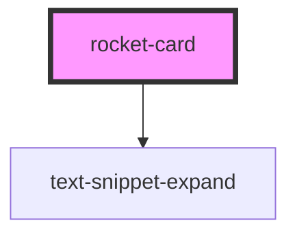

# rocket-card

<!-- Auto Generated Below -->

## Properties

| Property          | Attribute         | Description | Type               | Default     |
| ----------------- | ----------------- | ----------- | ------------------ | ----------- |
| `company`         | `company`         |             | `string`           | `undefined` |
| `country`         | `country`         |             | `string`           | `undefined` |
| `description`     | `description`     |             | `string`           | `undefined` |
| `diameterFeet`    | `diameter-feet`   |             | `number`           | `undefined` |
| `diameterMeters`  | `diameter-meters` |             | `number`           | `undefined` |
| `first_flight`    | `first_flight`    |             | `string`           | `undefined` |
| `heightFeet`      | `height-feet`     |             | `number`           | `undefined` |
| `heightMeters`    | `height-meters`   |             | `number`           | `undefined` |
| `image`           | `image`           |             | `string`           | `undefined` |
| `massKg`          | `mass-kg`         |             | `number`           | `undefined` |
| `massLb`          | `mass-lb`         |             | `number`           | `undefined` |
| `name`            | `name`            |             | `string`           | `undefined` |
| `payload_weights` | `payload_weights` |             | `number`           | `undefined` |
| `stages`          | `stages`          |             | `number \| string` | `undefined` |

## Dependencies

### Depends on

- [text-snippet-expand](../text-snippet-expand)

### Graph

----------------------------------------------

*Built with [StencilJS](https://stenciljs.com/)*
