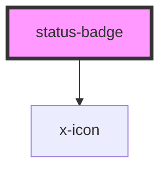

# status-badge

<!-- Auto Generated Below -->

## Properties

| Property     | Attribute     | Description | Type                                                                        | Default     |
| ------------ | ------------- | ----------- | --------------------------------------------------------------------------- | ----------- |
| `autoRemove` | `auto-remove` |             | `boolean`                                                                   | `false`     |
| `message`    | `message`     |             | `string`                                                                    | `undefined` |
| `persistent` | `persistent`  |             | `boolean`                                                                   | `false`     |
| `status`     | `status`      |             | `"critical" \| "danger" \| "info" \| "secondary" \| "success" \| "warning"` | `undefined` |
| `ttl`        | `ttl`         |             | `number`                                                                    | `undefined` |

## Dependencies

### Depends on

- [x-icon](../x-icon)

### Graph

----------------------------------------------

*Built with [StencilJS](https://stenciljs.com/)*
