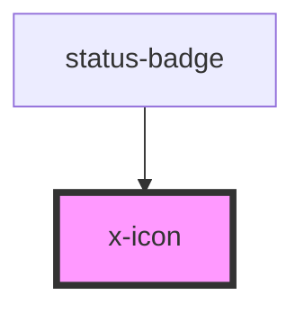

# x-icon

<!-- Auto Generated Below -->

## Dependencies

### Used by

 - [status-badge](../status-badge)

### Graph

----------------------------------------------

*Built with [StencilJS](https://stenciljs.com/)*
